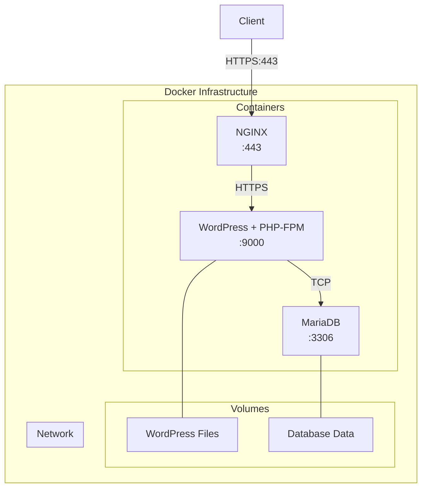
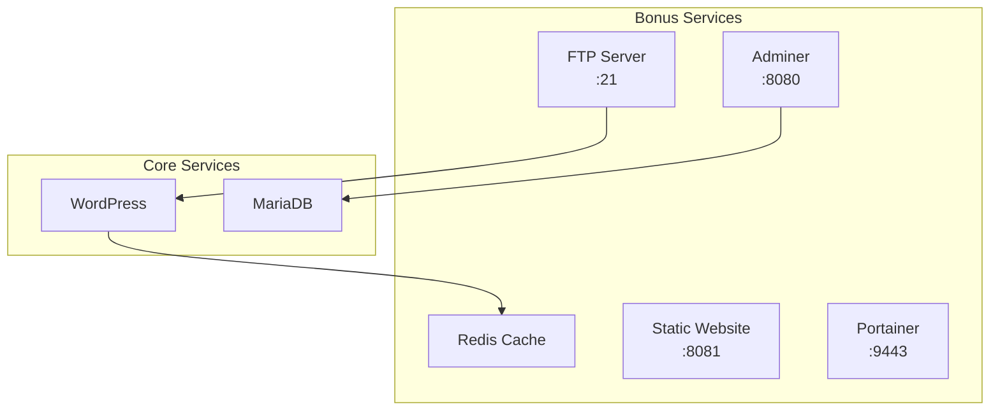

# Inception Project

## 📋 Project Overview
Inception is a System Administration project that focuses on Docker containerization and orchestration. The project involves setting up a complete web infrastructure using Docker Compose, with multiple services running in dedicated containers. Each service is built from scratch using either Debian or Alpine as the base image.

## 🎯 Key Requirements
- All Docker images must be built from scratch (no ready-made images)
- Services must restart automatically if they fail
- Docker volumes for data persistence
- Docker network for container communication
- Environment variables for configuration
- TLS v1.2 or v1.3 for HTTPS connections
- No usage of network: "host" or --link or links:
- No ssh usage inside containers
- No password authentication for database

## ⚡ Quick Start

1. Clone the repository:
```bash
git clone https://github.com/bjniane/Inception.git
cd Inception
```

2. Set up environment variables:
```bash
# Create .env file in srcs directory
cp srcs/.env.example srcs/.env
# Edit the .env file with your configurations
```

3. Build and start services:
```bash
make up
```

4. Access services:
- WordPress: https://localhost
- Adminer: https://localhost:8080
- Static Website: https://localhost:8081
- Portainer: https://localhost:9443

5. Stop services:
```bash
make down
```

## 🏗 Project Architecture

### Core Infrastructure


### Core Services
1. **NGINX Container**
   - TLS/SSL enabled
   - Reverse proxy configuration
   - Port 443 exposed

2. **WordPress Container**
   - PHP-FPM configuration
   - WordPress core files
   - Custom configurations

3. **MariaDB Container**
   - Secure database configuration
   - Custom MySQL settings
   - Data persistence

## 🎁 Bonus Services

### Additional Infrastructure


## 🌐 Network Architecture

### Core Network Layout
```
                 ┌─────────────┐
                 │    NGINX    │ :443 (HTTPS)
                 │  Front-end  │◄──── User Traffic
                 └──────┬──────┘
                        │
                        ▼
                 ┌─────────────┐
                 │  WordPress  │
                 │   + PHP-FPM │
                 └──┬───────┬──┘
                    │       │
           ┌────────┘       └─────────┐
           ▼                          ▼
    ┌─────────────┐             ┌─────────────┐
    │   MariaDB   │             │    Redis    │
    │  Database   │             │    Cache    │
    └─────────────┘             └─────────────┘
```

### Extended Network Layout (Including Bonus Services)
```
                            User Traffic
                                 │
                                 ▼
                 ┌───────────────────────────┐
                 │          NGINX            │ :443
                 │        Front-end          │
                 └─┬─────────┬───────┬─────┬─┘
                   │         │       │     │
                   ▼         ▼       ▼     ▼
         ┌─────────────┐   ┌───┐   ┌───┐ ┌───┐
         │  WordPress  │   │FTP│   │STA│ │PRT│
         │   PHP-FPM   │   │SRV│   │TIC│ │NER│
         └─┬─────────┬─┘   └───┘   └───┘ └───┘
           │         │      :21    :8081 :9443
           ▼         ▼
   ┌─────────────┐  ┌───────────┐
   │   MariaDB   │  │   Redis   │
   │  Database   │  │   Cache   │
   └──────┬──────┘  └───────────┘
          │
          ▼
    ┌──────────┐
    │  Adminer │ :8080
    └──────────┘
```

### Network Details

#### Service Ports
| Service    | Port | Protocol | Description                    |
|------------|------|----------|--------------------------------|
| NGINX      | 443  | HTTPS    | Main web server entry point    |
| WordPress  | 9000 | FastCGI  | PHP-FPM internal communication |
| MariaDB    | 3306 | TCP      | Database internal access       |
| FTP        | 21   | FTP      | File Transfer Protocol         |
| Adminer    | 8080 | HTTPS    | Database management interface  |
| Static     | 8081 | HTTPS    | Static website                 |
| Portainer  | 9443 | HTTPS    | Docker management interface    |

#### Security Measures
- All external communications are encrypted via TLS/SSL
- Internal network is isolated from external access
- Backend services are not directly exposed to the internet
- Container-to-container communication is restricted to necessary paths
- No direct database access from external networks

## 🛠 Prerequisites

- Docker
- Docker Compose
- Make

## 📦 Installation & Setup

1. Clone the repository:
```bash
git clone https://github.com/yourusername/Inception.git
cd Inception
```

2. Create necessary directories:
```bash
make prepare
```

3. Start the services:
```bash
make up
```

4. Stop the services:
```bash
make down
```

5. Clean up:
```bash
make clean
```

## 🔧 Configuration

### SSL Certificate
- Self-signed SSL certificate is automatically generated
- Accessible via HTTPS on port 443

### Service Details

#### WordPress
- URL: https://localhost
- Admin panel: https://localhost/wp-admin

#### Adminer
- URL: https://localhost:8080

#### Static Website
- URL: https://localhost:8081

#### FTP Server
- Port: 21
- Mode: Passive

#### Portainer
- URL: https://localhost:9443

#### Redis Cache
- Integrated with WordPress for improved performance

## 📁 Project Structure

```
Inception/
├── Makefile
└── srcs/
    ├── docker-compose.yml
    └── requirements/
        ├── bonus/
        │   ├── adminer/
        │   ├── ftp-server/
        │   ├── portainer/
        │   ├── redis_cache/
        │   └── static/
        ├── mariadb/
        ├── nginx/
        └── wordpress/
```

## 🔐 Environment Variables

Create a `.env` file in the `srcs` directory with the following variables:

```env
# WordPress Configuration
WORDPRESS_DB_HOST=mariadb
WORDPRESS_DB_NAME=wordpress
WORDPRESS_DB_USER=your_wp_user
WORDPRESS_DB_PASSWORD=your_wp_password

# MariaDB Configuration
MYSQL_ROOT_PASSWORD=your_root_password
MYSQL_USER=your_wp_user
MYSQL_PASSWORD=your_wp_password
MYSQL_DATABASE=wordpress

# FTP Configuration
FTP_USER=your_ftp_user
FTP_PASS=your_ftp_password
```

## 📝 Notes

- All containers are built from scratch using Debian or Alpine as base images
- Data persistence is ensured through Docker volumes
- Services auto-restart in case of failure
- SSL/TLS encryption is enabled for secure communication

## 🤝 Contributing

Feel free to submit issues and pull requests.

## 📜 License

This project is licensed under the MIT License - see the LICENSE file for details.